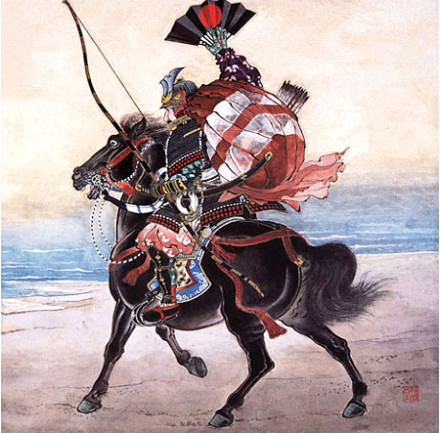

#cyan.svc.HoroShu

Author:DreamInSun 
Email: yancy_chen@hotmail.com 

========================================
## 项目概述：

Horoshu是针对分布式SOA运行环境下的统一服务调用框架。旨在短小轻便，解决分布式微服务环境的服务调用和管理问题。

该项目源自一个大型分布式跨机房开放平台CTOP，保留核心思路，采用开源库替代私有库，重构而成。

现有互联网服务方式已由传统的单机部署方式改为容器化部署，对Docker的容器部署方式有了全新的理解，为了不受限于K8S的复杂和未固化版本，特此设计了这个轻量级的服务调用框架。

与之配套的技术栈包括：OneRing和Nagzul

========================================

## 服务依赖：

* 服务注册 Rgistrator
* 配置管理 Etcd

========================================
## 项目特性：

### 快速Http请求库
* 基于HttpClient的Http链式调用封装库，调用者可以不考虑Http细节，如使用Javascript一样快速发起Http请求</li>
* 开箱即用，无需学习配置，一招搞定．</li>
* 多种常用Http Content-Type扩展，支持常见的服务器格式</li>
* 服务自管理一套同步调用框架和一套异步调用框架，可以快速将现有请求切换同步或异步调用方式</li>
* 调用全过程可插入Hook</li>

### 服务治理
* 通用的服务DNS，支持在应用层的服务名称转换和服务发现。</li>

### 多协议传输
* 支持JSON</li>
* 支持XML</li>

========================================
## Horoshu说明

> **"Horo Shu"**是日语“母衣众”的意思。
> 日本战国时代战场上最显眼的就要算那些身披母衣，（母衣是用竹制骨架把布撑成一个大球，战斗时披在背后起装饰作用，亦可防流矢）衣着鲜艳的精锐武士。
> 这是另一种具有纹章的效果的道具，当骑手独自疾驰的时候母衣会被风撑起来，这往往也可以作为大名的骑马武士侍卫（马回众）的分辩特征。
>母衣众是大将与兵团之间通信的重要桥梁，本项目也希望承担控制者与服务直接的通信职责。